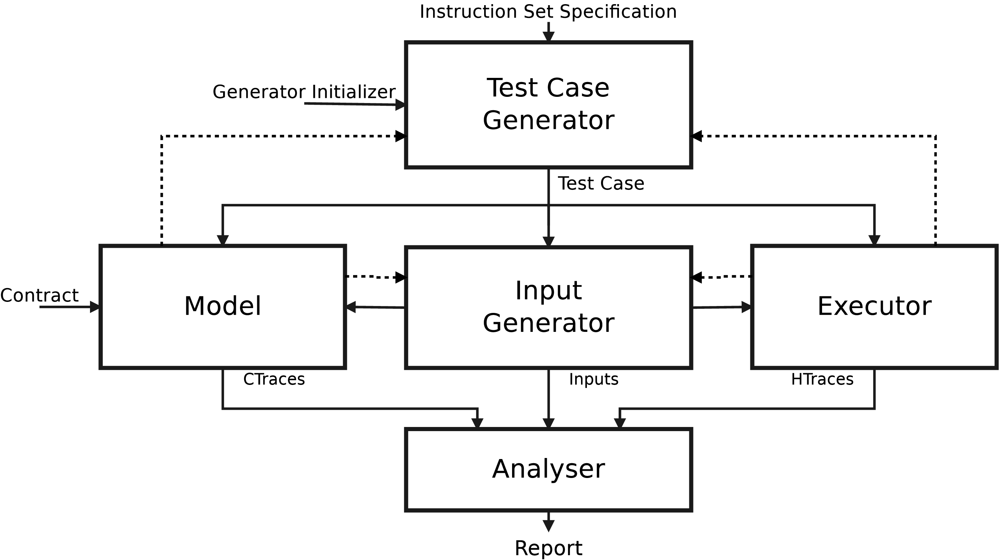

# Revizor

This is Revizor, a microarchitectural fuzzer.
It is an rather unconventional fuzzer as, instead of finding bugs in programs, Revizor searches for microarchitectural bugs in CPUs.

What is a microarchitectural bug?
In the context of Revizor, a bug is a violation of out expectations about the CPU behaviour.
The most prominent examples would be [Spectre](https://spectreattack.com/) and [Meltdown](https://meltdownattack.com/).
Alternatively, a "bug" could also be in a form of a microarchitectural backdoor or an unknown optimization, although we are yet to encounter one of those.

See our ~~[Technical Report]~~ (under construction) for details.


**Origin**: This is an independently developed and improved fork of [SCA-Fuzzer from Microsoft](https://github.com/microsoft/sca-fuzzer).

# Getting Started

Below are quick-and-dirty instructions on how to use Revizor.
More detailed instructions will be added some time later.

If you find missing explanations or a bug in Revizor, don't hesitate to open an issue.


**Warning**: Revizor executes randomly generated code in kernel space.
As you can imagine, things can go wrong.
Usually they don't, but sometimes they do.
So, make sure you're not running these experiments on an important machine.

0. Requirements:
   * Linux v5.6+ (tested on Linux v5.6.6-300 and v5.6.13-100; there is a good chance it will work on other versions as well, but it's not guaranteed).
   * Linux Kernel Headers
   * Python 3.7+
   * [Unicorn 1.0.2+](https://www.unicorn-engine.org/docs/)
   * [PyYAML](https://pyyaml.org/wiki/PyYAMLDocumentation)
   * For tests: [Bash Automated Testing System](https://bats-core.readthedocs.io/en/latest/index.html)
    
1. Get dependencies:

```bash
git submodule init
git submodule update
cp src/executor/x86/base.xml instruction_sets/x86
```

2. Install the x86 executor:

```bash
cd src/executor/x86 
sudo rmmod x86-executor
make clean
make
sudo insmod x86-executor.ko
```

3. Test it:

```bash
cd src/
./tests/run.bats
```

If some of the "Detection" tests fail, it's fine, you might just have a slightly different microarchitecture. But if other tests fail - something is broken.

4. Fuzz it:

This one should not detect any violations and should take a few minutes to run:

```bash
cd src/
./cli.py fuzz -s instruction_sets/x86/base.xml -i 1000 -n 10 -v -c ../evaluation/1_fuzzing_main/bm-bpas.yaml
```

5. Find your first Spectre!

This one should detect a violations within several minutes.
The detected violation is most likely an instance of Spectre V1.

```bash
cd src/
./cli.py fuzz -s instruction_sets/x86/base.xml -i 50 -n 1000 -v -c ../evaluation/fast-spectre-v1.yaml
```

You can find the test case that triggered this violation in `src/generated.asm`.


# Interfaces and Architecture



**Under construction**

[comment]: <> (## Instruction Set Spec)

[comment]: <> (This XML file: https://www.uops.info/xml.html originating from Intel XED &#40;https://intelxed.github.io/&#41;)

[comment]: <> (Received from: `--instruction-set` &#40;or `-s`&#41; CLI argument.)

[comment]: <> (Passed down to: `Generator.__init__`)


[comment]: <> (## Generator Initializer)

[comment]: <> (None so far.)

[comment]: <> (In future, may include test case templates, grammar, etc.)

[comment]: <> (## Test Case)

[comment]: <> (An assembly file. Currently, in Intel syntax.)

[comment]: <> (Received from: `self.generator.create_test_case&#40;&#41;` + `self.generator.materialize&#40;filename&#41;`)

[comment]: <> (Passed down to: `model.load_test_case` and `executor.load_test_case`)


[comment]: <> (## Inputs)

[comment]: <> (Currently, each input is a single 32-bit integer, used later as a PRNG seed inside the test case to initialize memory and registers.)

[comment]: <> (Inputs are generated in batches; that is, Input Generator returns `List[int]`.)

[comment]: <> (Received from: `input_gen.generate&#40;...&#41;`)

[comment]: <> (Passed down to: `model.trace_test_case&#40;inputs&#41;` and `executor.trace_test_case&#40;inputs&#41;`.)
